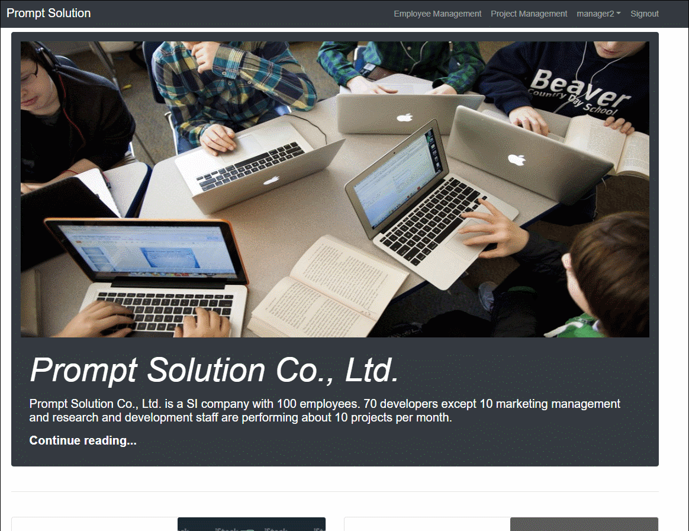

# company-web

## Table of Contents

1. [개발 환경](#개발-환경)
2. [Getting Started](#getting-started)
   - [Prerequisites](#prerequisites)
   - [Running this project](#running-this-project)
3. [Screenshots](#screenshots)
4. [Todo](#todo)


## 개발 환경

- pug + css + bootstrap4 + jQuery

- node.js + express.js + MySQL

  

## Getting Started

#### Prerequisites

config/dbconfig.js

```javascript
module.exports = {
  host: 'localhost',
  user: '<your-username>',
  password: '<your-mysql-password>',
  database: '<your-datase-name>'
}
```

#### Running this project

```
$ npm install
$ npm start
```


## Screenshots




## Todo

### 권민찬


### 배진영

- **18-05-12** 
  - view 추가 및 수정
    - 추가: includes/cards.pug, includes/main_image.pug, includes/records.pug, searches/search.pug
    - 수정: layout.pug, footer.pug, signin.pug, new.pug, stylesheets/style.css

- **18-05-16**
  - 추가: evaluations/client_evaluations.pug, evaluations/developer_evaluations.pug
  - 수정 완료: signin.pug, users/new.pug
  - 수정중: users/edit.pug, users/show.pug
  - 예정: employee_list, employee_detail page, admin_emp_insert_page, admin_project_insert_page

- **18-05-19**
  - 추가: searches/details/*

- **18-05-21**
  - 추가: views/pm/*, views/peer/* --> evaluate link page, set role page, add/delete member page, etc.
    - 수정: PM and peer evaluate link page(18-05-22)

  

- **18-05-22**
    - 수정: routers/users.js
    - signup form 수정해야할거 -> profile 입력칸 삭제, account input rrn 추가, num&rrn 비교후 register

###### 


### 이성희

- **18-05-08** 
  - 추가 : async-error.js

- ##### 18-05-13

  - 인증 & 암호화
    - 추가 : lib/passport-config.js, routes/auth.js 
  - 회원가입
    - 추가: '/new'.get.post(routes/users.js)
  - 계정 정보수정
    - 추가
      - '/:id/edit'.get(routes/users.js)
      - '/:id'.put(routes/users.js) 
  - 수정: '/'.get(routes/index.js)

- ##### 18-05-14
  - 회원가입 form 변경
  - 로그인 버그 수정
  - 프로필 정보 수정
  - 비밀번호 수정

- ##### 18-05-15
  - 수정 : employees/index.pug, projects/index.pug

- ##### 18-05-17
  - 추가 : routes/evaluations.js
  - 수정 : app.js(router 추가), users/new.pug(value수정, placeholder로 변경), evaluations/client_evaluation_form.pug(name 수정/ projects들어왔을 경우 추가), evaluations/peer_evaluation_form.pug(name 수정/ projects들어왔을 경우 추가), includes/topnav.pug(pm url 변경)

- ##### 18-05-18
  - 수정 : signin.pug, users/new.pug(부서 data 맞게 넣음), users/edit.pug(해당하는 부서 data 넣고 선택 수정), includes/topnav.pug(계정id 보이도록 수정), lib/passport-config.js(session 수정), app.js(body-parser 추가), routes/evaluations.js(validate~수정), routes/users.js(정보수정할 때 부서정보 넘김)

- ##### 18-05-21
  - 수정 : employees/index.pug(검색 & 정보 줄임), projects/index.pug(검색), routes/employees.js(직원 검색, 상세페이지), routes/projects.js(검색, 상세페이지)
  - 추가 : projects/details.pug, employees.details.pug(복구)

- ##### 18-05-22
  - 수정 : pm/index.pug, pm/client_evaluation.pug, routes/pm.js(client목록), client_evaluation_form.pug(정보 출력), routes/evaluations.js(client post), view/user/edit, new.pug(select name)

- ##### 18-05-23
  - 수정 : routes/pm.js(form, details get, 일단 add member ~ing, delete), pm/index.pug(프로젝트 form 복구), pm/project_details.pug(form, url), evaluations/forms/pm_evaluation_form.pug(input name, value, url 수정), routes/evaluations.js(pm get, post 추가)
  - 버튼 되면 redirect확인, curdate() 확인

### 정지우


